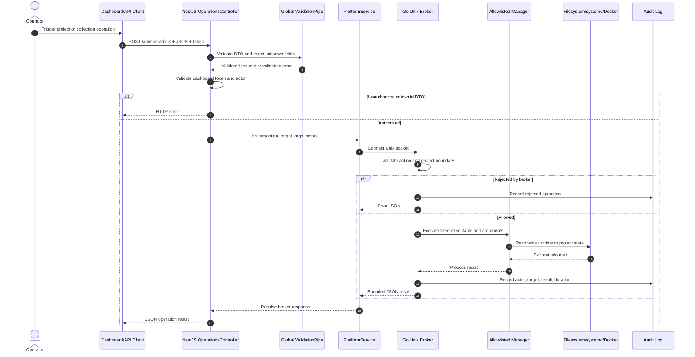
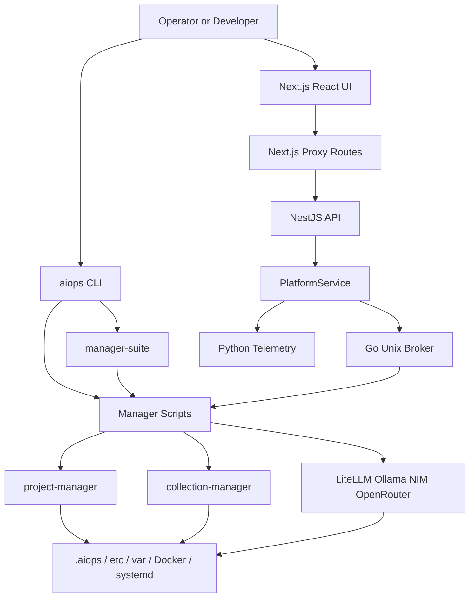
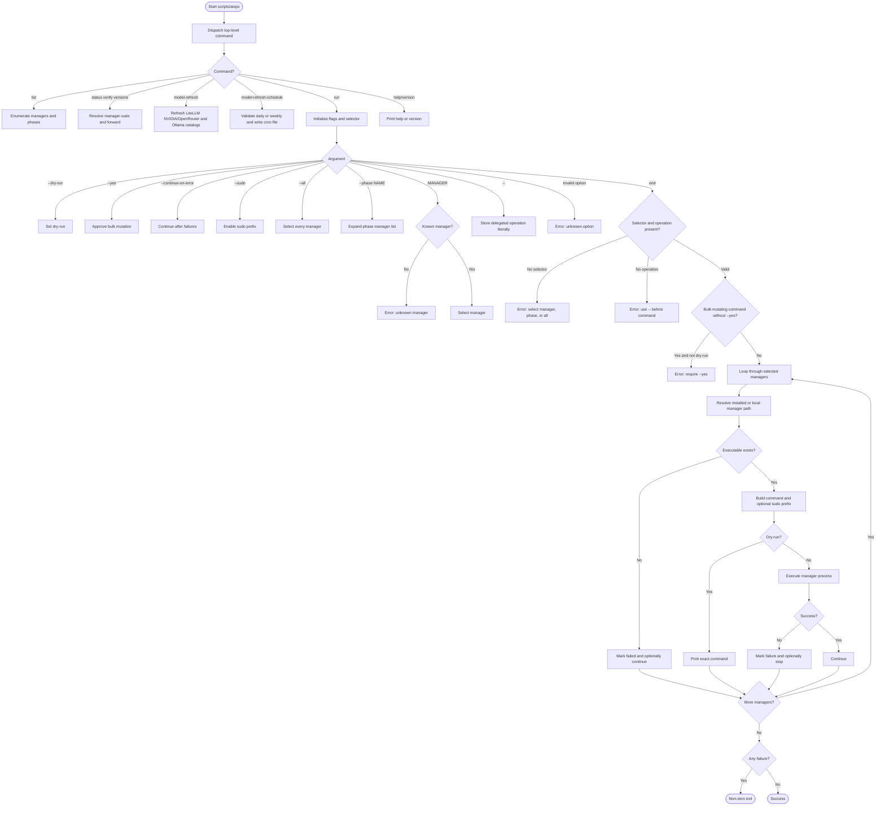

# SIMHA AiOps Architecture, Lifecycle, and Context Report

**Release:** 1.0.0  
**Repository:** `simhaonline/aiops`

## 1. Core purpose and users

SIMHA AiOps is a production-oriented operations control plane for installing, configuring, verifying, and lifecycle-managing an AI development and inference server. It keeps host, AI runtime, provider gateway, project isolation, collection, networking, and dashboard concerns in separate managers instead of one unrestricted installer or administrative API.

Primary users are infrastructure/platform administrators, AI/ML engineers, developers working in isolated AI-enabled projects, and security-conscious operators. The optional SIMHA Studio dashboard provides a unified UI for text, codebases, documents, image, video, voice, translation, workflows, projects, registry assets, and operations.

## 2. Technology stack and dependencies

| Area | Technology | Role |
|---|---|---|
| Host automation | Bash | 23 lifecycle managers, installation, cron, validation |
| Web | Next.js 16, React 19, TypeScript | SIMHA Studio UI and server-side proxy routes |
| API | NestJS 11, Fastify, class-validator | Health, overview, capabilities, and operations endpoints |
| Privileged boundary | Go | Unix-socket broker with fixed operation allowlist |
| Telemetry | Python | Host/manager telemetry snapshot service |
| Isolation | Docker Compose | Per-project development and collection environments |
| Services | systemd | Runtime, dashboard, broker, telemetry, and scheduled collection lifecycle |
| Edge | Nginx, Certbot | TLS, authentication, and loopback proxying |
| AI gateway | LiteLLM | Provider/model routing and model catalog synchronization |
| Providers | Ollama Cloud, NVIDIA NIM, OpenRouter | Cloud model sources and verified-free model discovery |
| Collection | Scrapling container | Restricted public-source collection |
| Testing | Node test, Go test, Python unittest, Bash QA | Unit, integration-style, security, and release checks |
| Database | None mandatory | State is filesystem, systemd, Docker, and provider configuration based |

Forgejo optionally uses PostgreSQL. The core suite has no central application database or ORM.

## 3. Module boundaries

| Module | Scope |
|---|---|
| `scripts/` | Independent lifecycle managers |
| `scripts/aiops` | Unified CLI, phase selection, dry runs, bulk safety, model refresh scheduling |
| `scripts/manager-suite` | Inventory, versions, verification, dependencies, installation order |
| `scripts/project-manager` | Isolated project container, AI assets, MCP, features, backups, restore |
| `scripts/collection-manager` | Scrapling policy, crawling, collection UI, schedules, backups |
| `scripts/litellm-manager` | LiteLLM lifecycle, provider keys, verified-free model synchronization |
| `scripts/ollama-manager` | Ollama Cloud policy and approved Cloud model catalog |
| `scripts/aiops-dashboard-manager` | Dashboard deployment, systemd, Docker, broker, telemetry, backup, edge |
| `dashboard/apps/web` | Next.js/React Studio interface and proxy routes |
| `dashboard/apps/api` | NestJS controllers and platform service |
| `dashboard/broker` | Go Unix-socket privileged operation broker |
| `dashboard/telemetry` | Python telemetry collector |
| `qa/` | Release, security, regression, and manager tests |

## 4. Explicit out-of-scope behavior

The repository does not provide arbitrary shell execution, a central user/conversation database, built-in SSO/OAuth/SCIM, automatic installation of discovered skills/agents/MCP/plugins, unrestricted crawling, browser-side provider secrets, host Docker socket access from web/API containers, automatic installation of every runtime, provider billing management, or a complete multimodal inference/workflow execution backend. Public authentication is handled at the Nginx edge; the internal operations API additionally requires `AIOPS_DASHBOARD_TOKEN`.

## 5. Core API request lifecycle

The security-sensitive API operation path is `POST /api/operations`:

1. A client submits an operation, target, arguments, and dashboard token.
2. NestJS global `ValidationPipe` rejects unknown fields and validates the DTO.
3. `OperationsController` validates the token and actor.
4. `PlatformService` opens the protected broker Unix socket.
5. The Go broker validates the actor, action, project path, and symlink boundary.
6. The broker maps the action through a fixed switch to one manager executable.
7. The manager mutates project/runtime filesystem, Docker, or systemd state.
8. The broker bounds execution with a timeout, captures output, and writes an audit entry.
9. JSON travels back through `PlatformService`, NestJS/Fastify, and the client.



The CLI path is separate: `scripts/aiops` parses a manager/phase selector, validates mutation safety, resolves a local or installed manager, and executes it serially. It does not use the dashboard API or broker.

## 6. Coupling hotspots and relationships

| Hotspot | Relied upon by | Reason for coupling |
|---|---|---|
| `scripts/aiops` manager and phase arrays | CLI, QA, automation | Central manager registry and dispatch policy |
| `scripts/manager-suite` | Status, verification, dependency workflows | Central runtime inventory |
| `PlatformService` | Overview and operations controllers | Telemetry, project discovery, and broker boundary |
| `AppModule` | All NestJS controllers | Dependency composition root |
| Go `resolve()` | All broker operations | Privileged action mapping |
| Go `projectPath()` | Project and collection operations | Shared path and symlink security gate |
| `.aiops` layout | Project, collection, and dashboard modules | Filesystem state contract |
| LiteLLM config | LiteLLM service and model refresh | Provider/model configuration contract |

There is little classical inheritance. NestJS controllers/services, React components, Go structs/functions, and Python telemetry functions are concrete implementations. The dominant abstraction is process/protocol composition rather than class inheritance.



## 7. Project memory and context

### Architectural decisions

- Independent Bash managers keep runtime lifecycle concerns isolated.
- `aiops` orchestrates managers without replacing their domain logic.
- Web/API processes are unprivileged; only the Go broker crosses into privileged manager execution.
- A Unix socket and fixed allowlist are used instead of a privileged TCP shell/API.
- `.aiops` provides portable, inspectable, project-local state.
- AI assets, MCP definitions, credentials, and agent state are isolated per project.
- LiteLLM centralizes model/provider routing.
- Verified-free-first model selection is explicit and provider-aware.
- Public registry content is quarantined and cannot auto-install.
- Loopback-first binding requires explicit Nginx/TLS/authentication to publish services.
- Release manifests and checksums support reproducible bootstrap installation.

### State models

Projects use:

```text
/srv/projects/<name>/
├── AGENTS.md
├── .gitignore
└── .aiops/
    ├── compose.yaml
    ├── project.env
    ├── container/Dockerfile
    ├── home/.codex/skills/
    ├── home/.codex/plugins/
    ├── ai/assets.lock
    ├── ai/mcp.json
    ├── secrets/
    ├── features/
    ├── collections/
    └── backups/
```

The dashboard has overview and capability JSON models, but no persistent conversation store. LiteLLM stores model configuration under `/etc/litellm/config.yaml`; Ollama Cloud policy is under `/etc/ollama-cloud/ollama.env` and its systemd override.

### Gotchas

- Bootstrap installs manager commands, not every runtime.
- `aiops` and `manager-suite` duplicate manager registries and both need updates when a manager changes.
- The Studio composer is currently a capability/UI foundation, not a complete persisted streaming chat backend.
- `PlatformService` falls back to an unavailable telemetry response when telemetry cannot be reached.
- `.aiops/project.env` is required for dashboard project discovery.
- Provider APIs can change model metadata formats; model filters must remain conservative.
- Collection validation cannot fully eliminate DNS rebinding; enforce egress policy for high-risk deployments.
- Project backups can contain secrets and must be protected as secret-bearing artifacts.
- Regenerate `MANIFEST.json` and `SHA256SUMS.txt` after release-file changes.

### Conventions

- Bash uses `set -Eeuo pipefail`, strict IFS, `readonly` constants, explicit `require_*` guards, and `die/info/warn` helpers.
- TypeScript uses strict mode, functional React components, NestJS decorators, and `class-validator` DTOs.
- Go uses explicit switch allowlists, context timeouts, bounded output, and JSON-over-Unix-socket communication.
- Python uses small module-level functions and standard-library tests.
- Security policies are encoded in `qa/` regression tests and release validation.

## 8. Representative control-flow analysis: `scripts/aiops`

No file/function was specified in the original request, so this report uses the unified CLI entry point as the representative function. The primary branches are top-level dispatch, selector parsing, mutation safety, manager resolution, dry-run handling, execution, and aggregate failure handling.



